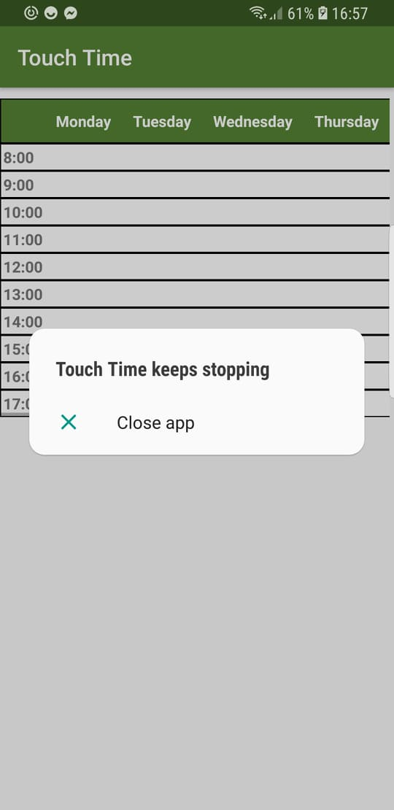

# CA326 Third Year Project

## Testing Documentation

**Jacob Byrne - 15492172**

**Daniel Pereira - 15364491**

# Unit Testing

## Server Side Testing

All testing scripts can be found in the code directory.

### Testing of bsoup.py

File utbsoup.py runs test cases on all bsoup definitions.

Results for each test case are as follows.

*Testing for True*

[&#39;test1 for true&#39;, True, True, True, True, True, True, True, True, &#39;test1end&#39;]

*Testing for True*

[&#39;test2 for true&#39;, True, True, True, True, True, True, &#39;test2end&#39;]

*Testing for except*

[&#39;test3 for except&#39;, &#39;except&#39;, &#39;except&#39;, &#39;except&#39;, &#39;except&#39;, &#39;test3end&#39;]

*Testing for valid*

[&#39;test4 for valid&#39;, &#39;valid&#39;, &#39;valid&#39;, &#39;valid&#39;, &#39;valid&#39;, &#39;valid&#39;, &#39;valid&#39;, &#39;valid&#39;, &#39;valid&#39;, &#39;test4end&#39;]

*Testing for invalid*

[&#39;test5 for invalid&#39;, &#39;invalid&#39;, &#39;invalid&#39;, &#39;invalid&#39;, &#39;invalid&#39;, &#39;invalid&#39;, &#39;valid&#39;, &#39;test5end&#39;]

*Testing for except*

[&#39;test6 for except&#39;, &#39;except&#39;, &#39;except&#39;, &#39;except&#39;, &#39;except&#39;, &#39;test6end&#39;]

As seen from results above all test cases run as expected.

### Testing of routes.py
For testing routes.py it was run locally on [http://127.0.0.1:5000/](http://127.0.0.1:5000/). Testing was performed by passing different variable cases through the url. Screenshot samples can be found in the unitTestRoutes directory.

Test1was a default url for our server

Test2 was the timetable directory

Test3 is a misspelled path, and throws a 404 error

Test4 is a second timetable directory

Test5 is checks that details for a room are being returned from the server

Test6 is for an invalid room id, and returns a class not found string

Test7 is a second test for invalid room id. It returns a class not found string

Test8 is increases attendance counter for specified room and returns its timetable.

Test9 is run after Test8 has been run four times. Test9 returns the attendance counter for the specified room.
All test ran with a expected results.

All python test files can be found in the code directory.

## Android App Side Testing

When trying to view a timetable after entering an invalid location id we initially found an unhandled error that would crash the app.

After handling this exception and performing tests of valid and invalid room id&#39;s the app ran as expected.

*Before*                        
<!--  -->

*After*

When performing user testing we gave a sample login for lecturer view to our participant. From their feedback we discovered that upon entering incorrect login details there was no feedback from the app to say the details were incorrect.

To correct this issue we added an &quot;invalid authentication&quot; message.

As part of testing the android side of our application and the integration between it and the server, we used the app on multiple devices (emulated and physical): a Samsung Galaxy S8, Samsung Galaxy A6, Google Nexus 5 ane Google Pixel 2 XL. We found that the apps scaled well to the different screen sizes for most screens. We noted however that on a the smallest screen we tested (Galaxy A6), that the View Timetable button and Check Attendance button were quite cluttered. We added more padding around each to solve this issue. Screenshots of how the app scales on multiple devices are included below. Note that all views of timetable are populated so that a user can scroll left/right to view all days. 

Galaxy A6  
 
 
 
 

Nexus 5  
 
 
 
 

Pixel 2 XL 
 
 
 
 

We also ensured to handle all possible errors. For example, when given an invalid NFC tag the app prints an appropriate return statement. Likewise if a phone doesn&#39;t have NFC capabilities, the app recognises this and deals with it appropriately.

See below the updated Lecturer view on the Nexus 5, we added padding and chaining to the buttons so they scale correctly.

We also tested the Attendance function by using multiple devices to view the number of students who have checked into a room. This proved to produce a bug that we have yet to overcome at the time of submission. Values can become different between the two devices, this is illustrated below. We believe this is an issue with caching. This as as a result of the server throwing 302 and 303 HTTP error response codes. See error codes  below also. I found this by running:

&#39;cat /var/log/apache2/access.log | grep &#39;301\|302\|303&#39; &#39;

Galaxy S8                             

 
GalaxyA3
 

 

# User-Acceptance Testing

**TO DO** Interview 8 more people

# Continuous Integration Testing

Due to the nature of our project, continuous integration was vital. Often we would be making multiple commits to GitLab a day. This required coordination and consistent communication between us. Thankfully, even though we were collectively working off Master, we kept conflicts to a minimum. In hindsight we should have used branches and merge requests to avoid this problem.

We also insured as we periodically increased functionality to trial the feature added in order to avoid issues as the project came to an end. This was a very effective method as any potential bugs became apparent as the feature was added, leaving us with minimal bugs to fix once we achieved full functionality.

# Deployment Testing

As part of our project, we had to transition from running our Flask API locally to deploying it to a server. We used a Digital Ocean Instance running an Apache 2 server to do this. To use this reliably we had to carry out tests on both the deployed version of the server. We mainly carried out stress tests. We did this by bombarding the server with multiple requests from multiple devices in order to see if it caused a crash or slowed responses. I also wrote a small shell script to make 1000 get requests to multiple pages on the server in order to carry out the stress test. This can be found in the code directory on the gitlab server.

