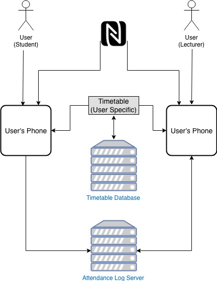
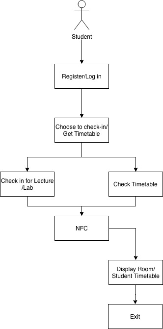
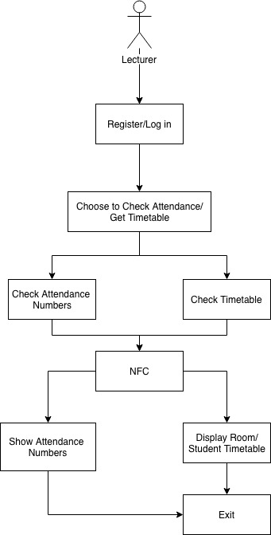
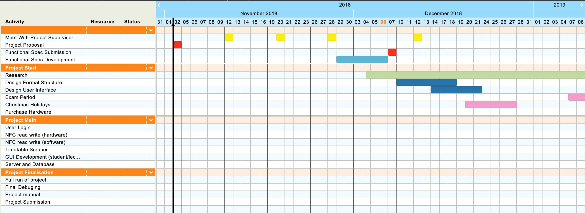
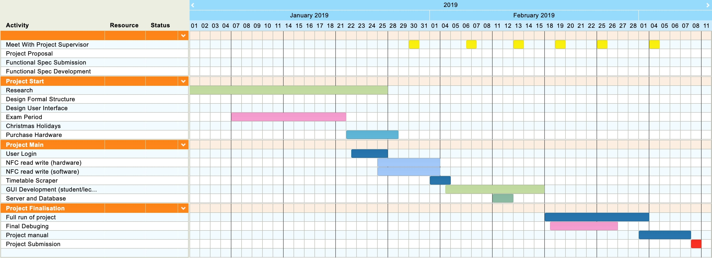

# CA326 Third Year Project

# Functional Specification

# *Touch Time*

### Jacob Byrne
### Daniel Pereira

## Table of contents

**0.Table of Contents**						 

**1.Introduction**  
1.1 Overview  
1.2 Scope  
1.3 Glossary	  								
 
**2.General Description**  
2.1 Product Functions  
2.2 User Characteristics   
2.3 User Scenarios  
2.3.1 Login & Timetable View  
2.3.2 Student Attendance & Change Login  
2.3.3 Lecture Attendance  
2.4 Constraints   					 

**3.Functional Requirements**  
3.1 External Requirements  
3.1.1 Software requirements  
3.1.2 Hardware Requirements	  
3.2 System Functions  
3.2.1 NFC Reading  
3.2.2 User Login  
3.2.3 Scalability  								 

**4.System Architecture**  
4.1 System Architecture Diagram  			

**5.High Level Design**  
5.1 High Level Design Diagrams  
5.1.1 Student View  
5.1.2 Lecturer View  

**5.2 High Level Design Description**  
5.2.1 Student View  
6.5.2.2 Lecturer View  							

**6.Preliminary Schedule**  
6.1 Schedule Description  
6.1.1 Diagram November-December  
6.1.2 Diagram January-March  
 
**7.Appendices**  
7.1 Resources									 

## Section 1 - Introduction
**1.1 Overview**
Touch Time is an iOS based app, that uses the built in Near Field Communication (NFC) functionality on iPhones.The objective of the app is to provide an easily accessible and quick to use timetabling system. We will achieve this by placing NFC tags on the doors to lecture theatres and labs around a sample of rooms in the Mcnulty and Stokes building. The system, once developed will provide users with up to date room bookings for lecture rooms and labs around campus. With certain permissions lecturers will be able to set up an attendance based system for their lectures/labs. This will involve students tapping their phones off the NFC tags to sign in. This will cut down on paper based attendance checking lecturers have used up to this point.

**1.2 Scope**
The goals for Touch Time are to provide a timetabling system that is easily accessible. This will be achieved by having a simple to use user interface along with intuitive NFC capabilities. We will also be incorporating a Text-to-speech functionality to include a wider demographic. 

**1.3 Glossary**
**NFC** - **N**ear **F**ield **C**ommunication 
NFC is a short-range wireless connectivity standard that enables communication between 2 devices when they’re brought within a few centimetres of each other. 

**Swift**
Swift is a compiled programming language developed by Apple for iOS. 

**GDPR** - **G**eneral **D**ata **P**rotection **R**egulation
European Union Law on protection of data and privacy for all individuals in the European Union.

**iOS**
Native Apple Operating system for their mobile devices.

**AWS**
On demand cloud computing service.

**Flask**
Flask is a micro web framework written in Python

**MySQL**
Open Source Relational Database Management System.

## Section 2 - General Description
**2.1 Product Functions**
Touch Time us an easy-to-use, widely accessible timetable and attendance taking app for DCU students and Lecturers. From a student’s perspective, we'll have the ability to touch their phone off of any NFC tag on the doors of Stokes or McNulty buildings and be able to see that rooms timetable for a certain timeline. They will also have the option to touch the phone off of their student card, and receive their own timetable for a certain time period. With the permission of the user we will pull select information off of the student cards (that being their course code, year of study, name and student number). This information will be stored on the individuals Device, and their course code and year will be used to give them their timetable.  
Lecturers, tutors and other select users will be given all the same features as students. They will also have the option to set up a class attendance system. The concept behind this is, a lecturer will set up a room where the class is going to be held. Whenever a student who is enrolled to take the lecture touches off the NFC tag associated with the lecture room the student’s name and a student number can be sent to the lecturer to signify that the student is present in the class.

**2.2 User Characteristics**
User groups can be broken into 2 categories, Student and Lecturer view. We will first address the Student view and then tackle the problem of the Lecturer view. 
Students will be able to view information about their timetable and use NFC capabilities of the app to check a room timetable as per the apps functionality. 
Lecturers view will be a more expanded view, they will also be able to add a booking to a room on this local system and as students arrive at the room tap the NFC chip to show attendance.  

**2.3 User Scenarios**    
*2.3.1 Login & Timetable View*
Upon opening the app, a user will be prompted to tap their student/staff card off their phone. They may opt out of this and instead give their course details (being course code and year). They can then view their timetable anytime they open up the app.  

*2.3.2 Student Attendance & Change Login*
If attendance is being taken for a lecture it will be set up on the specific room before it commences. For a student to mark themselves as attended, they must login to the app with their student card. They can then touch their phone off of the lecture room nfc tag to mark their attendance. If a student doesn't have an NFC enabled phone they can use their student card to login on somebody else's phone.  

*2.3.3 Lecture Attendance*
In order to set up Attendance functionality a user must login with a staff card, they will have the option to take attendance for any lecture on their timetable. For any lecture that the lecturer selects for attendance, the information is pushed to the student timetables associated with the modules. When the lecture time slot is over the lecturer will receive a list of, student names numbers and the time when they tapped the tag.  

**2.4 Constraints**
To allow users to take timetable information given information from student cards through NFC scanning and be the best timetabling service for DCU is our goal. We are limited to certain degree by a number of factors.

Our biggest constraint is with GDPR with regards to using student/staff cards to access users information. We have had meetings with DCU iss and unfortunately it doesn’t currently seem feasible. We will attempt to combat this with a dataset of our own design to show a hypothetical working environment.

We are also, due to restraints out of our control, limited to using Apple Products, namely iPhone 7(and above) and as a result of this must use XCode (Apple IDE) to program in Swift. 

There is also a cost constraint for the project. The challenge will be to find the correct hardware that will fit our needs without costing too much. Between the stokes and mcnulty  buildings there are over a hundred room entrances. We will therefore take a select group of rooms for our environment to run on to keep initial costs down.

## Section 3 - Functional Requirements
**3.1 External Requirements**
*3.1.1 Software Requirements*
For our system, at the base level we use the following software:
Xcode - For swift development
NFC  Ideas - For encoding the all the NFC tags
iOS - iPhone's operating system for hosting the app.
Server Side Implementation: We need to tie down what networking capabilities we will implement, possibilities include: 
AWS S3
React
Flask
We may also implement a MySQL Database of timetables we refresh weekly.  

*3.1.2 Hardware Requirements*
For the physical side of our project we will be using the following hardware:
iPhone 7(and above) - for our app to run on due to NFC capabilities on the device
NFC tags - The specific tags are yet to be confirmed but they will be small and stickable.
MIFARE Ultralight Read/Writer - Used in order to write key information to our tags.  
  
*3.1.3 User Interface*
The swift development studio natively supports iOS and therefore is the perfect suit for the program. It will allow support for the built in text to speech functionality of iPhones.  

**3.2 System Functions**
*3.2.1 NFC Reading*
The system we intend to implement will be able to take information from 2 different sources, 1.our writable NFC tags with information we put on them with key information about a room (lecture theatre/lab) 2.Any DCU student card in order for them to gain information about the user, namely their Student ID and Course Code.  

*3.2.2 User Login*
Students or lecturers will be able to login to the system via their student/staff cards, their information will be used to pull their personalised timetable and see it on the app. Another option for users is to input only specific details on the app, all timetables will be up to date within a certain time period.  

*3.2.3 Scalability*
Once the system is setup, there is a potential to introduce it for all of the campus. Due to low cost of the NFC chips this is a very feasible option. Depending on the demand for the project  and if GDPR issues are worked out there is a future possibility to include android devices in the system.  

# Section 4 - System Architecture

**4.1 System Architecture Diagram**

# Section 5 - High Level Design

**5.1 High Level Design Diagram**

*5.1.1 High Level Design Diagram - Student View*

*5.1.2 High Level Design Diagram - Lecturer View*

**5.2 High Level Design Description**
*5.2.1 Student View (Fig 5.1.1 and Fig 5.1.2 explained below)*
**Step 1: Select User as ‘Student’** 
Each user of the app will have to provide the app initially with what purpose they are using the app for.  
**Step 2: Register**
Provide Student Card with NFC or Course Details(Course Code including Year).  
**Step 3: Check**
Timetable/Attend Lab 
Specify to the app if user wants to check in at scheduled lab or display timetable given information previously provided.
Set up notification for next free lab slot.   
**Step 4: Scan Tag** 
Use NFC enabled iPhone to scan tag placed outside lab given choice in the previous step.
Will allow user to check in or be given timetable details.  
**Step 5: Log Out**
Once Student User is finished with the app they can exit the app or return to the home screen where they will be able to scan another room.  

*5.2.2 Lecturer View*
**Step 1: Select User as ‘Lecturer’**
Specify User type to the app.
**Step 2: Register**
Use staff card to authenticate lecturer registration.
**Step 3: Specify use**
As lecturers, these users get special privileges with the app. 
They can specify:
Check attendance at lab 
Display room information(like student)
Set up notifications(like student)
Book Time 
**Step 4: Tag NFC** 
Tag NFC given users choice.
Will also refresh list of students when checking attendance.
**Step 5: Exit**
When the user is satisfied they can return to the home screen.

# Section 6 - Preliminary Schedule
**6.1 Schedule Description**
There is a brief design of how the program is to be put together, as this is a preliminary design it is due to be changed over the course of the project.
The planner was created on www.tomsplanner.com

*6.1.1 Diagram November - December*

*6.1.2 Diagram January - March*

# Section 7 - Appendices
**7.1 Resources:**
https://www.tutorialspoint.com/swift/ 
https://developer.apple.com/documentation/ 
https://developer.apple.com/documentation/corenfc 
https://www.python.org/ 
https://httpd.apache.org/ 
https://www.mysql.com/ 
https://www.nfcideas.com/ 
https://www.upwork.com/hiring/mobile/hiring-an-ios-app-developer/ 
https://stackoverflow.com/questions/8397756/advices-on-server-implementation-for-server-client-structure-ios-app-development 
https://developer.apple.com/support/xcode/ 
https://www.tomsplanner.com 
