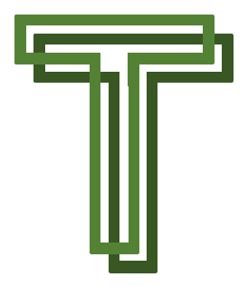

# CA326 Third Year Project 

## Technical Manual 

Jacob Byrne - 15492172
Daniel Pereira - 15364491

1. Introduction 
Overview 
Glossary 

2. System Architecture 
	2.1 	System Architecture Description 
	2.2. 	System Architecture Diagram

3. High Level Design  
	3.1 	Context Diagram 
	3.2 	Data Flow Diagram 
	3.3 	Overall System Design

4. Problems and Resolution

5. Installation Guide 

## Introduction 

**1.1 Overview**  
Touch Time is a timetable and attendance based system. 
The backend of the system is run on a server and handles authentication, parsing of DCU’s timetable and the attendance handling feature.

The app handles information that is being taken from the server upon request. The options for viewing a timetable are NFC or by filling out a text field. If a student scans an NFC tag the attendance for the room that they scan will increase by one. 

A lecturer can be set up on request with a username and password, which allows them to view the number of students checked into a specific room.

**1.2 Glossary**   
**NFC (Near Field Communication)** - Set of communication protocols that enable two electronic devices to pass information to each other by bringing them into close proximity to each other. 
**NFC Tags** - NFC enabled tags that store the ID of each room to be scanned by the app. 
**Android Studio** - An IDE(Integrated Development Environment) used to write the code for our Android App.  
**Flask** - Micro Web Framework written in Python that allows us to create a local server.  
**Digital Ocean** - Cloud Infrastructure Provider that allows users to deploy and scale applications.  
**Apache** - Open-Source cross-platform web server.  
**Java** - Compiled Programming Language.  
**HTTP** - Hypertext Transfer Protocol that defines how messages are formatted and transmitted over the internet. 
**Front-End** - User view of a given application/system. 
**Back-End** - Part of system that supports front-end, not directly accessed by user.  
**APK** (Android Application Package) - File format used  by Android Operating System for distribution and installation of applications.  
**Virtual Environment* - Tool that helps to keep dependencies required by different projects separate by creating separate virtual environments for them.

## 2. System Architecture 

**2.1 System Architecture Description** 
Outlined below is our System Architecture Diagram. It illustrates the main features of our app. The core functionality of Checking Timetables by searching for a room or scanning an NFC tag outside a room can be accessed by anyone. Checking attendance is a restricted feature that can only be accessed by pre-authorised users that are given their own unique username and password. 

**2.1 System Architecture Diagram** 

## 3. High Level Design 
**3.1 Context Diagram** 

 

**3.2 Data Flow Diagram**

**3.3 Overall System Design** 

## 4. Problems & Resolutions 

**Python Distribution**  
Problem: Multiple Python versions on Laptop causing issues for pip installations 
Solution: Using Virtual Environment to control exactly what versions of different pieces of Software we were using. 

**Server Side Implementation** 
Digital Ocean
Problem: Launching Flask server on Apache. 
Solution: Extensive Troubleshooting & fixing paths to requirements as they were different from running same scripts on local host. 

**Scraper** 
Problem: Insecure HTTPS requests from our scraper script. 
Solution: Turn on SSL Certification  

**Time Management**  
Exams 
Deadlines
Problem: Managing time by giving enough time to the project while balancing other commitments(exams, assignments etc.) 
Solution: Regular group meetings, setting ourselves realistic sprint goals to periodically add functionality. 

**Learning Curve with Android Development** 
Problem: Lack of experience with Java and the Android Studio Development Environment.  
Solution: Online tutorials were a huge benefit, trial and error and creating some sample apps to get more familiar with the environment were invaluable.

**Integrating server with Front End** 
Problem: Front end pulling from our server became difficult, also changing server could potentially adversely affect app.  
Solution: Continuous Integration Testing and error handling helped rectify this. 

**NFC Integration** 
Problem: Cost of using Apple NFC capabilities. 
Solution: Switching to Android.
Problem: Activating NFC capabilities in Android and adding the functionality to read the tags. This is a core functionality of our app, 
Solution: Finding the correct libraries to use and integrate with our app. Online tutorials were also hugely helpful. 

**Git Learning Curve** 
Problem: Working from master. 
Solution: Daily sprint meetings and constant communication between us as to when to commit to Git. 

**Testing Learning Curve** 
Problem: Lack of experience with Unit Testing.  
Solution: Continuously and periodically testing features at the end of sprints to minimise bugs. 

**DCU Timetable** 
Problem: There were multiple instances when the DCU timetable service that we scrape from went offline. 
Solution: Our solution to this was having our server save the raw html of a timetable each time it scrapes. If DCU’s timetable system if offline our server will parse and return the last successful timetable request.

**Android Studio apk’s** 
Problem: When integrating certain technologies phone apps would crash. 
Solution: By upgrading android manifest and gradle files on app builds we ensured that our app could keep up with the minimum technology requirements. 

## 5. Installation Guide 

We have uploaded our App to Google Drive, the app supports Android 4.1 Jellybean and above. The app is free to use. 

1. Click the following link: http://bit.do/touchtimetyp 
2. If you haven’t already, navigate to your settings and enable Third Party App installation.
3. Navigate to your devices downloads folder. 
4. Tap it and the installation process should start. 
5. Use and Enjoy! 

To run the server side locally go /code/server_side in our gitlab instance and carry out the following steps:
1. Download the Directory
2. Run in terminal pip install -r requirements.txt
3. Python3 routes.py 
3.1. In routes.py, comment lines 1,2 that show import sys & sys.path.append(‘var/www/FlaskApp/FlaskApp), this is for our deployed server only. 

The server is now deployed locally and can be queried on http://127.0.0.1:5000 
